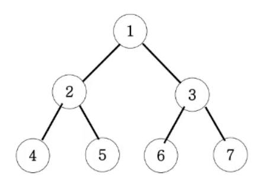

# 이진트리 순회 (DFS)

## 문제

아래 이진트리를 전위순회, 중위순회, 후위순회 순으로 출력하시오.
<br><br>


## 출력

- 전위순회: 1 2 4 5 3 7 6
- 중위순회: 4 2 5 1 6 3 7
- 후위순회: 4 5 2 6 7 3 1

## 풀이

```js
function solution(n) {
  // 전위순회
  let preAnswer = "";
  // 중위순회
  let midAnswer = "";
  // 후위순회
  let postAnswer = "";
  function rec(v) {
    if (v > 7) {
      return;
    }
    preAnswer += v;
    rec(v * 2);
    midAnswer += v;
    rec(v * 2 + 1);
    postAnswer += v;
  }
  rec(n);

  console.log(preAnswer);
  console.log(midAnswer);
  console.log(postAnswer);
}

solution(1);
```
