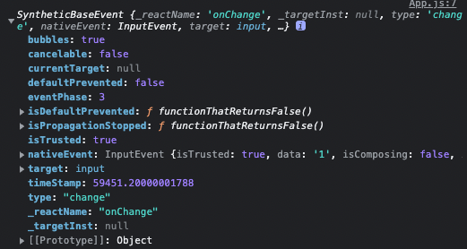

# 프록시 패턴

프록시 패턴은 중개자, 대신 요청하고 대신 응답을 받아주는 역할을 하는 프록시를 활용한 디자인 패턴이다.<br><br>

프록시 객체는 프록시 패턴을 사용할 때 실제 객체를 대신하는 객체를 말한다.

## 예시
아래 예시에서는 왕실 근위대의 왕실 근위대의 쁘락치(?) 역할을 하는 프록시 객체를 만들어 명령을 대신 수행하도록 구현되었다.

```js
class RoyalGuard {
    constructor(king) {
        this.king = king;
    }

    report(fact) {
        console.log(`${this.king}에게 ${fact}를 보고합니다.`);
    }

    assassinate(target) {
        console.log(`${target} 암살 명령을 받았습니다.`);
    }
}

class RoyalGuardProxy extends RoyalGuard {
    constructor(master) {
        super();
        this.royalGuard = new RoyalGuard('왕')
        this.master = master;
    }

    report(fact) {
        console.log(`${this.master}에게 ${fact}를 보고합니다.`);
        this.royalGuard.report('거짓');
    }

    assassinate(target) {
        console.log(`${target} 암살을 하지 않습니다.`);
        this.royalGuard.assassinate('왕');
    }
}

const royalGuardProxy = new RoyalGuardProxy('다빈님')
royalGuardProxy.report('사실');
console.log('-------------------------');
royalGuardProxy.assassinate('다빈님');
```

## 리액트에서 프록시 패턴

리액트에서도 프록시 패턴을 찾아볼 수 있는데 onClick 이벤트의 파라미터로 받는 이벤트 객체가 그러하다.

```html
<!DOCTYPE HTML>
<html>
  <body>
    <input id="input"/>
    <script>
        document.getElementById('input').addEventListener('change', function(e) {
            console.log(e);
        })
    </script>
  </body>
</html>
```

실제 DOM에서 위와 같이 onChange 이벤트를 콘솔에 찍으면 아래와 같이 이벤트 객체가 찍힌다.<br>

<br><br>
리액트에서는 이 DOM 이벤트를 감싸 SyntheticEvent라는 일종의 프록시 객체를 반환한다.
<br>

<br>

[SyntheticEvent](https://ko.reactjs.org/docs/events.html#gatsby-focus-wrapper)<br>
SyntheticEvent는 모든 브라우저에서 이벤트를 동일하게 처리(크로스 브라우징)을 위해 DOM 이벤트를 감싼 래퍼 객체이며 nativeEvent는 실제 DOM 이벤트를 가리킨다.