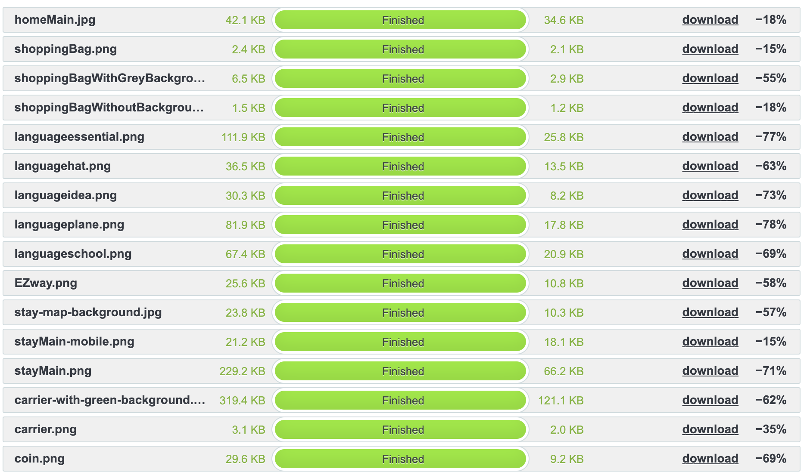
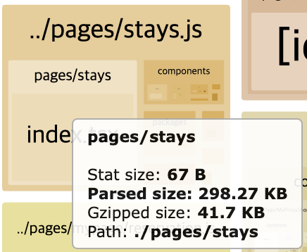
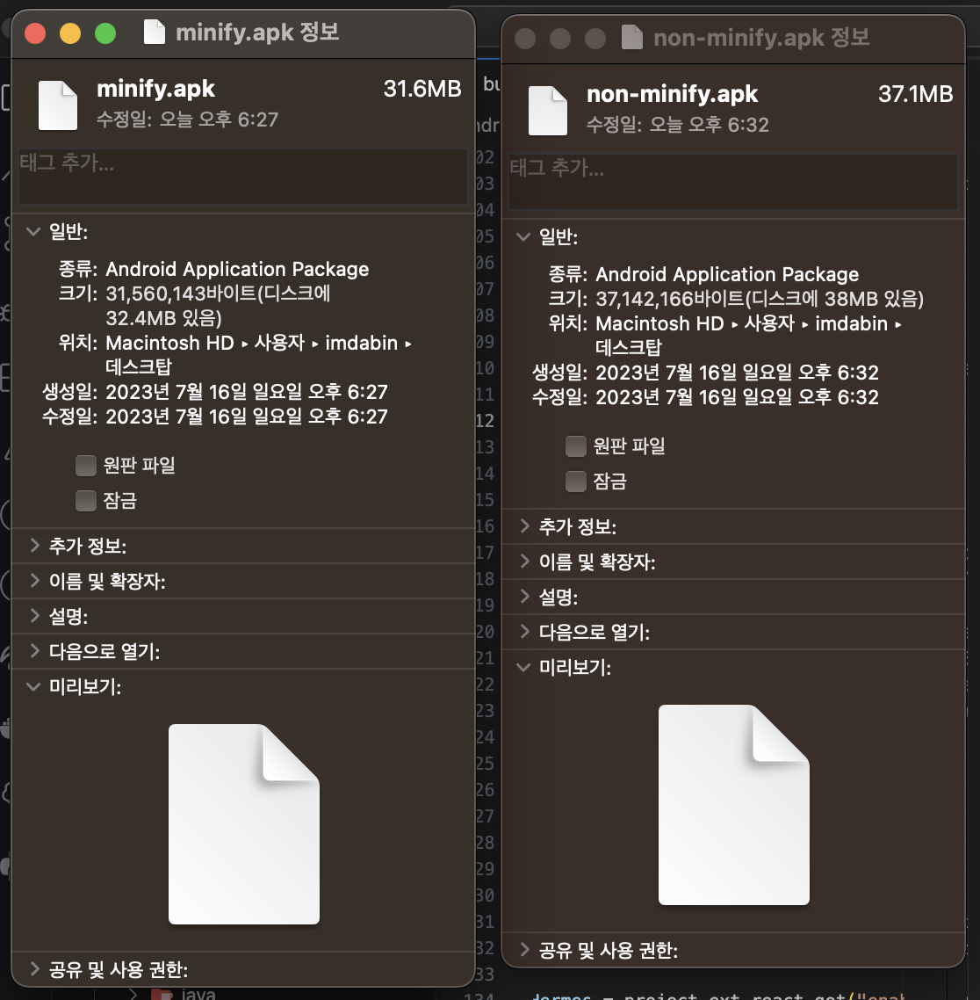

# 웹 사이트 성능 개선

## http 요청 수 줄이기

intersection observer를 활용한 lazy render

### 스크립트 파일 병합
정복과 분할 - 요청 수 증가
병합 - 요청 수 감소

번들링

## 콘텐츠 파일 크기 줄이기
tiny png 활용

### 스크립트 파일 압축 전달
Accept-Encoding - 클라이언트의 요청 (브라우저가 지원하는 압축 방식) 
Content-Encoding - 웹 서버가 사용할 압축 방식 명시

### 스크립트 파일 최소화
minimize uglify 

next bundle analyze - "analyze:dev": "ANALYZE=true npm run build:dev",

### 브라우저가 선호하는 이미지 포맷 사용

- jpeg
  - 손실압축
- png, gif
  - 비손실 압축
- jpegxr
  - 마이크로소프트
  - 손실, 비손실 압축 지원
  - IE에 최적화
- webp
  - 구글 이미지 포맷
  - 손실, 비손실 압축 지원
  - 손실 압축시 jpeg보다 30% 정도 파일 크기가 작아짐
  - 무손실 압축 사용시 png보다 20~30% 작아짐

### 큰 파일은 작게 나누어 전송

동영상 파일 
Accept-Ranges - 부분 지원 기능 수락 
Content-Length - 해당 파일 전체 크기 

## 캐시 최적화

프록시 서버
브라우저, 디바이스 캐시

### 브라우저 캐시

Cache-Control
- no-cache: 원본 캐시 걍신 여부 조사, 캐시 사용
- no-store: 민감한 정보, 캐시 사용하지 않음
- max-age: 캐시 시간 ms 단위
- must-revalidate: 캐시 주기 확인
- no-cache, no-store, must-revalidate -> 캐시 절대 불가능
- public: 캐시 사용
- Expires: 캐시 만료 시간

## CDN 사용
