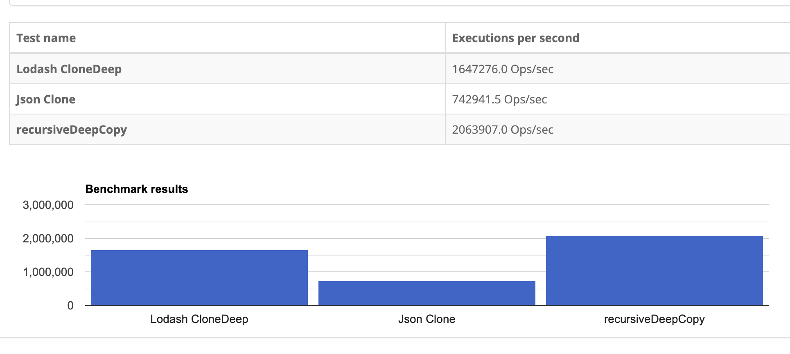
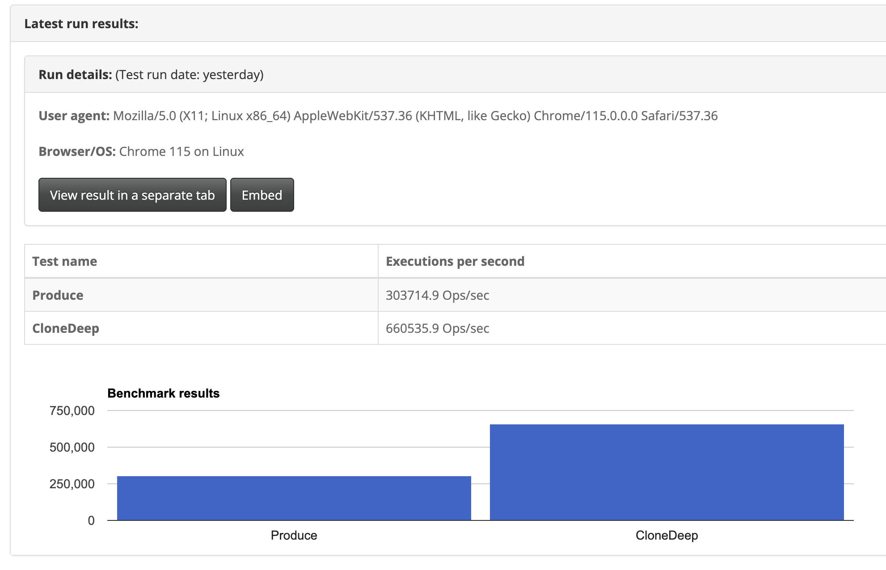

# 객체 복사 비용

## lodash clone vs JSON.stringify & JSON.parse vs recursive deep copy 

```js
function recursiveDeepCopy(o) {
    var newO,
      i;
  
    if (typeof o !== 'object') {
      return o;
    }
    if (!o) {
      return o;
    }
  
    if ('[object Array]' === Object.prototype.toString.apply(o)) {
      newO = [];
      for (i = 0; i < o.length; i += 1) {
        newO[i] = recursiveDeepCopy(o[i]);
      }
      return newO;
    }
  
    newO = {};
    for (i in o) {
      if (o.hasOwnProperty(i)) {
        newO[i] = recursiveDeepCopy(o[i]);
      }
    }
    return newO;
  }
```



## immer produce vs cloneDeep



## immer vs immutable


## 결론

요즘 시대에 이런 비용이 크게 중요하지 않은 건 팩트이나 미리 체크해놓고 더 이상 리소스를 쏟지 않아도 된다면 굳이 큰 비용을 지불할 필요는 없다.<br/>
재귀적으로 복사하는 함수를 만들어 사용하던가 (테스트 코드 작성 필요) <br/>
 편하게 cloneDeep 하던가